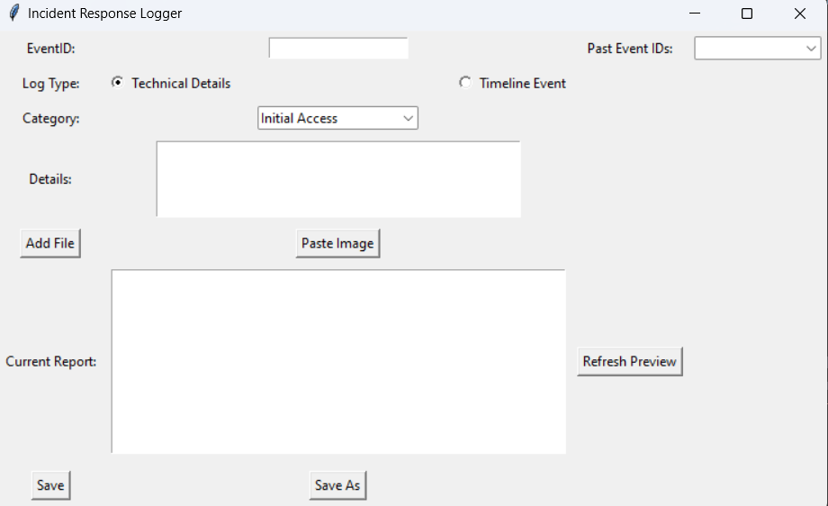
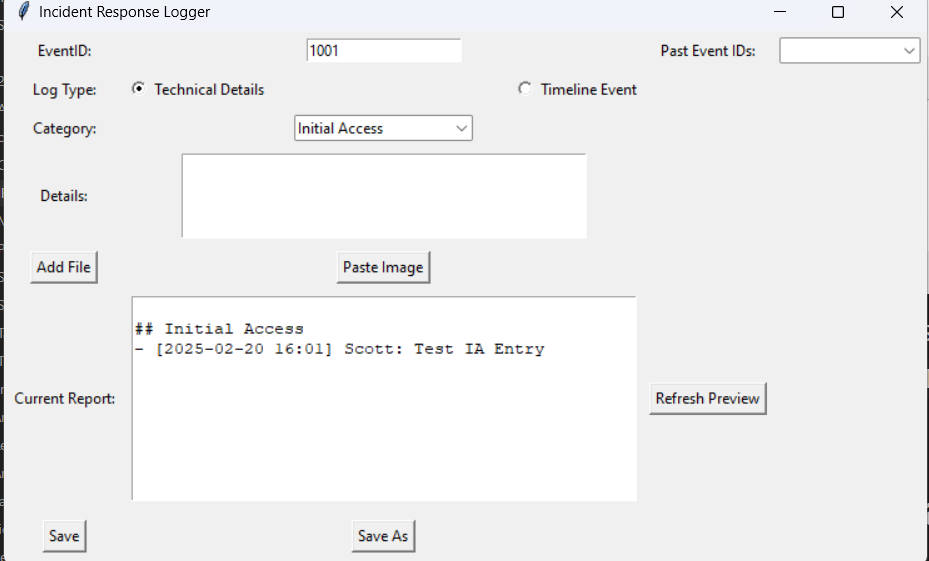
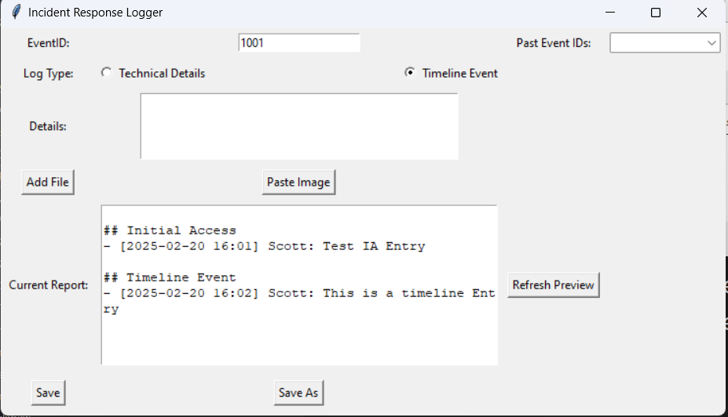
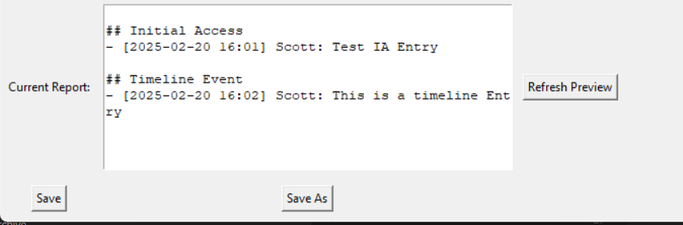
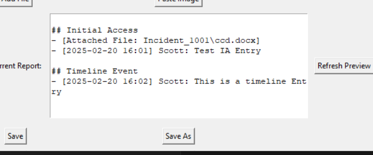

# Incident Response Logger

[](https://github.com/schlangens/ir-logger/actions/workflows/tests.yml)

**Incident Logger v2** is a hosted, multi-analyst incident-response logging
web app: a live shared timeline, MITRE ATT&CK technique tagging with a
coverage matrix, hashed evidence with chain of custody, full-text search,
report export (Markdown/PDF), and a tamper-evident audit log. The full
technical specification lives in [`SPEC.md`](SPEC.md).

**Security-minded?** Start with
[`SECURITY-NARRATIVE.md`](SECURITY-NARRATIVE.md) — the story of the threat
model, the real defects a live attack pass found, and how each one was fixed
and pinned by a regression test.

The original tool, **`ir-logger.py`**, is a single-file Python/Tkinter desktop
app for one analyst logging findings to local Markdown files. It still works
completely standalone, with no server and no account, exactly as it always
has — see [Desktop tool (v1)](#desktop-tool-v1) below. It can optionally be
pointed at a v2 server so its entries also land in a shared timeline; sync is
off by default and never required.

**Status:** the backend (accounts, workspaces, incidents, entries, technique
tagging, evidence, search, export, audit log, and an instant demo-workspace
API) is built and covered by the test suite below, and the browser UI is now
built too. **It is deployed and live at https://ir.scottslab.io** — open it
and click "Try the live demo" to use a disposable sandbox with no signup.
See [`ROADMAP.md`](ROADMAP.md) for what's shipped and what's left, including
the before-launch checklist and the one item on it that was skipped.

---

## Running the tests

Node test suite (187 tests, using Node's built-in test runner — no extra
install beyond `npm install`):

```
npm test
```

Python test suite (9 tests, using Python's built-in `unittest`, **not**
pytest — nothing needs to be installed for it):

```
python3 -m unittest discover -s tests -p 'test_*.py' -v
```

Both suites run automatically on every pull request and push to `main` (see
the badge above and [`.github/workflows/tests.yml`](.github/workflows/tests.yml)).

Note: `requirements.txt` lists `tkinter`, which is part of Python's standard
library and is **not** installed via `pip` — don't run
`pip install -r requirements.txt` expecting it to fetch tkinter. Only
`pillow` (used for optional clipboard-image support in the desktop tool) is
actually pip-installable.

## Running it locally

The web app is Node/Express with a SQLite database (`better-sqlite3`).

```
npm install
npm start
```

That's it for a quick local run — no environment variables are required in
development. On startup the app creates its SQLite database file and runs
its migrations automatically (default path `./data/ir-logger.db`, created if
missing), and generates a temporary session secret if none is set. It
listens on port `3059` by default, so `GET http://localhost:3059/health`
should return `{"status":"ok",...}` once it's running.

To customize it, copy `.env.example` to `.env` and fill in what you need:

| Variable | Default | Notes |
|---|---|---|
| `PORT` | `3059` | |
| `SESSION_SECRET` | random (dev only) | **required** if `NODE_ENV=production` |
| `DB_PATH` | `./data/ir-logger.db` | directory is created automatically |
| `EVIDENCE_DIR` | `./data/evidence` | uploaded evidence file storage |
| `BASE_URL` | `https://ir.scottslab.io` | used to build Google OAuth callback and invite URLs; this is the live deployment |
| `GOOGLE_CLIENT_ID` / `GOOGLE_CLIENT_SECRET` | unset | only needed to enable "Sign in with Google"; email+password accounts work without them |
| `NODE_ENV` | unset | set to `production` to require `SESSION_SECRET` and secure cookies |
| `REGISTRATION_OPEN` | open (unset) | set to the literal string `false` to close public sign-up on this instance — the default is **open** so a fresh clone always works with zero configuration. Existing accounts can still log in when closed, and an owner can still add a colleague by invite (the invite link lets that one new account through). The live deployment sets this to `false`. |

The app serves a browser interface from `public/` alongside its JSON API
(routes under `/api/...`, plus `GET /health`). Sign-in is email and password;
Google is optional and its button only appears when it is actually
configured, so a clone with no configuration has no dead controls.

---

# Desktop tool (v1)

The "Incident Response Logger" is a graphical user interface (GUI) tool built with Python and `tkinter` to assist incident response (IR) analysts in logging and organizing findings during an incident investigation. It supports logging technical details, timeline events, file attachments, and image captures, with options for both event-specific folder outputs (`Incident_<EventID>/`) or standalone Markdown files.

## Features
- Log technical findings under categories like Initial Access, Persistence, and Exfiltration.
- Record timeline events for chronological tracking.
- Attach files and paste images from the clipboard (requires `Pillow`).
- Save logs to event-specific folders (`Incident_<EventID>/Event_Report.md`) or standalone Markdown files.
- Load and preview past event logs using a dropdown of existing `EventID`s.
- Option to save locally for non-collaborative work.

### Empty State

The initial state of the GUI, ready for input with the `EventID` field and past events dropdown.

### Technical Details Entry

An example of logging a technical finding under "Initial Access," including text and an attached image.

### Timeline Event Entry

An example of logging a timeline event, such as "Incident escalated."

### Preview with Entries

The "Current Report" showing logged entries for `EventID 1001` after refreshing.

### File Attachment

An example of attaching a file, visible in the "Details" and saved to the event folder.


---

## Instructions to Install Dependencies:
Ensure you have Python installed on your system.

Open a terminal or command prompt.

Navigate to the directory where your requirements.txt file is located.

Run the following command:

``pip install -r requirements.txt``

This will install the required dependencies for your script. Note that tkinter is included with Python by default, so it may not need installation separately. However, pillow must be installed for image handling features to work.
    

## Usage Instructions

### 1. Starting the Tool

Upon launching, the GUI displays:

- An `EventID` entry field for unique identification (e.g., `1001`).
    
- A "Past Event IDs" dropdown to load existing event logs.
    
- Options for "Technical Details" or "Timeline Event" logging.
    
- A category dropdown (for "Technical Details"), "Details" text box, and buttons for file/image attachments.
    

### 2. Logging an Entry

#### Technical Details

1. Enter `EventID` (e.g., `1001`) or select from "Past Event IDs" to load existing data.
    
2. Select **Log Type**: "Technical Details."
    
3. Choose **Category** (e.g., "Initial Access").
    
4. Add **Details** (e.g., "Phishing email detected").
    
5. Attach files/images:
    
    - **Add File**: Uploads a file (saved to `Incident_<EventID>/` and linked in the log).
        
    - **Paste Image**: Pastes an image from the clipboard (requires `Pillow`).
        
6. **Save**:
    
    - Click "Save" to log the entry to `Incident_<EventID>/Event_Report.md`.
        
    - Or click "Save As" to choose a custom Markdown file location.
        

#### Timeline Event

1. Enter `EventID`.
    
2. Select **Log Type**: "Timeline Event."
    
3. Add **Details** (e.g., "Incident escalated to management").
    
4. Click **Save** or **Save As** to log under the "Timeline Event" section.
    

### 3. Previewing Logs

- Click **Refresh Preview** to view the current contents of `Incident_<EventID>/Event_Report.md` or the standalone `.md` file.
    
- The preview shows raw Markdown text (not rendered images or formatting). Use an external Markdown viewer (e.g., VS Code, GitHub) for full visualization.
    

### 4. Loading Past Events

- Use the "Past Event IDs" dropdown to select an existing `EventID` (e.g., `1001`).
    
- The GUI loads the corresponding `Incident_<EventID>/Event_Report.md` or `<EventID>.md` for review or continued logging.
    

### 5. Non-Collaborative Work

- Use **Save As** to save logs to a custom location.
    
- Use **Save** for event-specific folders to avoid shared file conflicts.
    

### 6. Optional: Syncing to the web app

Sync is entirely optional and off by default — with no sync settings saved, the tool behaves exactly as described above and never contacts a server.

1. Click **Sync Settings** (next to "Save" / "Save As") and enter:
    
    - **Server base URL**: the Incident Logger v2 instance you want entries to land in (e.g. `https://ir.example.com`).
        
    - **API token**: create one on the web app's **workspace settings** page, in its API tokens section, and paste it here.
        
2. Click **Save** in the dialog. The values are written to `ir-logger-sync.json` next to `ir-logger.py` (git-ignored) so they persist between runs. The token is only ever stored in that local file.
    
3. From then on, each **Save** / **Save As** writes the local Markdown entry first, exactly as before, and then attempts to send the same entry to the server. The `EventID` is used as the incident reference, and the incident is created on the server if it doesn't exist yet.
    
4. A status label under the buttons shows the result: `Synced ✓ <HH:MM:SS>` on success, or `Sync failed (saved locally)` if the server is unreachable, the token is rejected, or the request times out (5 seconds).
    

The server URL must use `https`; `http` is allowed only for `localhost`, `127.0.0.1`, or `[::1]` development servers. The token file is created with `0600` permissions (on Windows, POSIX mode bits do not apply the same way and `chmod` only toggles the read-only bit, so restrict it with NTFS ACLs/file properties). Redirects are rejected as sync failures. A blank `EventID` skips sync, and timestamps are sent as UTC. Python's `urllib` honors `http_proxy`/`https_proxy` from the environment, so incident text and the bearer token traverse whatever proxy the responder's host has configured.

Sync is best-effort and always secondary to the local file: a sync failure never blocks a save, never pops up an error dialog, and never loses an entry — the local Markdown file remains the authoritative record. Attachments added with **Add File** and **Paste Image** stay local-only and are not synced.

---

## File Structure

- **Event Folders**: Logs are stored in `Incident_<EventID>/Event_Report.md` by default, with attached files/images in the same folder (e.g., `Incident_1001/screenshot_20250220_...png`).
    
- **Standalone Files**: Optionally, save as `<EventID>.md` using "Save As."
    
- **Samples**: Attached files and images are linked in Markdown as `[Attached File: ...]` or `[Attached Image: ...]`.
    

---

## Troubleshooting

- **Images Not Working**: Ensure `Pillow` is installed (`pip install Pillow`). Verify an image is in the clipboard before pasting.
    
- **Empty Preview**: Ensure the `EventID` matches an existing `Incident_<EventID>/` folder or `.md` file. Click "Refresh Preview" to update.
    
- **Permissions**: Verify write permissions for your working directory (e.g., `C:\Users\YourDirectory\`).
    

---

## Contributing

- Fork this repository, modify `ir-logger.py`, and submit pull requests on GitHub.
    
- Report issues or suggest features by opening an issue on the GitHub repository.
    

---

## License

This project is licensed under the MIT License - see [LICENSE](LICENSE).
