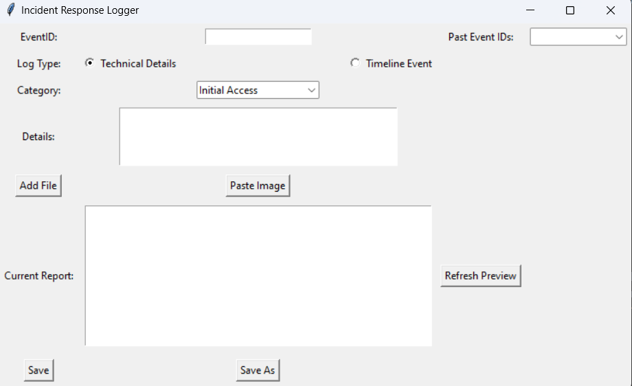

# Incident Response Logger

The "Incident Response Logger" is a graphical user interface (GUI) tool built with Python and `tkinter` to assist incident response (IR) analysts in logging and organizing findings during an incident investigation. It supports logging technical details, timeline events, file attachments, and image captures, with options for both event-specific folder outputs (`Incident_<EventID>/`) or standalone Markdown files.

## Features
- Log technical findings under categories like Initial Access, Persistence, and Exfiltration.
- Record timeline events for chronological tracking.
- Attach files and paste images from the clipboard (requires `Pillow`).
- Save logs to event-specific folders (`Incident_<EventID>/Event_Report.md`) or standalone Markdown files.
- Load and preview past event logs using a dropdown of existing `EventID`s.
- Option to save locally for non-collaborative work.

### Empty State

The initial state of the GUI, ready for input with the `EventID` field and past events dropdown.

### Technical Details Entry

An example of logging a technical finding under "Initial Access," including text and an attached image.

### Timeline Event Entry

An example of logging a timeline event, such as "Incident escalated."

### Preview with Entries

The "Current Report" showing logged entries for `EventID 1001` after refreshing.

### File Attachment

An example of attaching a file, visible in the "Details" and saved to the event folder.

---

## Instructions to Install Dependencies:
Ensure you have Python installed on your system.

Open a terminal or command prompt.

Navigate to the directory where your requirements.txt file is located.

Run the following command:

``pip install -r requirements.txt``

This will install the required dependencies for your script. Note that tkinter is included with Python by default, so it may not need installation separately. However, pillow must be installed for image handling features to work.
    

## Usage Instructions

### 1. Starting the Tool

Upon launching, the GUI displays:

- An `EventID` entry field for unique identification (e.g., `1001`).
    
- A "Past Event IDs" dropdown to load existing event logs.
    
- Options for "Technical Details" or "Timeline Event" logging.
    
- A category dropdown (for "Technical Details"), "Details" text box, and buttons for file/image attachments.
    

### 2. Logging an Entry

#### Technical Details

1. Enter `EventID` (e.g., `1001`) or select from "Past Event IDs" to load existing data.
    
2. Select **Log Type**: "Technical Details."
    
3. Choose **Category** (e.g., "Initial Access").
    
4. Add **Details** (e.g., "Phishing email detected").
    
5. Attach files/images:
    
    - **Add File**: Uploads a file (saved to `Incident_<EventID>/` and linked in the log).
        
    - **Paste Image**: Pastes an image from the clipboard (requires `Pillow`).
        
6. **Save**:
    
    - Click "Save" to log the entry to `Incident_<EventID>/Event_Report.md`.
        
    - Or click "Save As" to choose a custom Markdown file location.
        

#### Timeline Event

1. Enter `EventID`.
    
2. Select **Log Type**: "Timeline Event."
    
3. Add **Details** (e.g., "Incident escalated to management").
    
4. Click **Save** or **Save As** to log under the "Timeline Event" section.
    

### 3. Previewing Logs

- Click **Refresh Preview** to view the current contents of `Incident_<EventID>/Event_Report.md` or the standalone `.md` file.
    
- The preview shows raw Markdown text (not rendered images or formatting). Use an external Markdown viewer (e.g., VS Code, GitHub) for full visualization.
    

### 4. Loading Past Events

- Use the "Past Event IDs" dropdown to select an existing `EventID` (e.g., `1001`).
    
- The GUI loads the corresponding `Incident_<EventID>/Event_Report.md` or `<EventID>.md` for review or continued logging.
    

### 5. Non-Collaborative Work

- Use **Save As** to save logs to a custom location.
    
- Use **Save** for event-specific folders to avoid shared file conflicts.
    

---

## File Structure

- **Event Folders**: Logs are stored in `Incident_<EventID>/Event_Report.md` by default, with attached files/images in the same folder (e.g., `Incident_1001/screenshot_20250220_...png`).
    
- **Standalone Files**: Optionally, save as `<EventID>.md` using "Save As."
    
- **Samples**: Attached files and images are linked in Markdown as `[Attached File: ...]` or `[Attached Image: ...]`.
    

---

## Troubleshooting

- **Images Not Working**: Ensure `Pillow` is installed (`pip install Pillow`). Verify an image is in the clipboard before pasting.
    
- **Empty Preview**: Ensure the `EventID` matches an existing `Incident_<EventID>/` folder or `.md` file. Click "Refresh Preview" to update.
    
- **Permissions**: Verify write permissions for your working directory (e.g., `C:\Users\YourDirectory\`).
    

---

## Contributing

- Fork this repository, modify `ir-logger.py`, and submit pull requests on GitHub.
    
- Report issues or suggest features by opening an issue on the GitHub repository.
    

---

## License

This project is licensed under MIT - see the LICENSE file for details (if applicable).